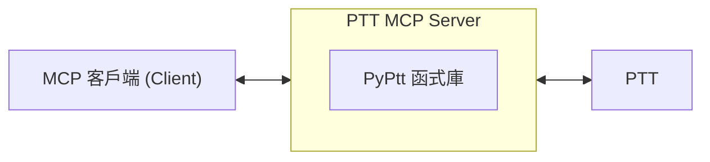

[English Version](https://github.com/PyPtt/ptt_mcp_server/blob/main/README_ENG.md)

<h1 align="center">PTT MCP Server</h1>

<p align="center">
The best MCP server for Ptt. Proudly built by <a href="https://pyptt.cc/">PyPtt</a> developer.
<br />
<br />

<a href="https://github.com/PyPtt/ptt_mcp_server/actions/workflows/code_quality.yml">

</a>

<a href="https://github.com/PyPtt/ptt_mcp_server/blob/main/LICENSE">

</a>
</p>


## 📖 專案介紹 (Description)
本專案是一個 PTT MCP (Model Context Protocol) 伺服器，它基於功能強大的 [`PyPtt`](https://pyptt.cc/) 函式庫。這使得您的 MCP 客戶端能夠真正登入 PTT 並透過 MCP 協定與 PTT 批踢踢實業坊進行實際互動，並實現自動化操作。

## 🚀 快速開始 (Quick Start)

使用 Docker 部署 PTT MCP Server 是最推薦的方式，它提供了環境隔離和簡化的設定。

1.  **安裝 Docker**：
    如果您的系統尚未安裝 Docker，請參考 [Docker 官方文件](https://docs.docker.com/get-docker/) 進行安裝。

2.  **設定 MCP 客戶端**：
    將以下設定加入您的 MCP 客戶端設定檔 (例如：`~/.gemini/settings.json`)。此配置會讓 MCP 客戶端在需要時自動拉取並運行 Docker 容器。

    ```json
    {
      "mcpServers": {
        "PTT": {
          "command": "docker",
          "args": [
            "run",
            "-i",
            "--rm",
            "-e", "PTT_ID",
            "-e", "PTT_PW",
            "ghcr.io/pyptt/ptt_mcp_server:latest"
          ],
          "env": {
            "PTT_ID": "YOUR_PTT_ID", // 請換成您自己的 PTT 帳號
            "PTT_PW": "YOUR_PTT_PW"  // 請換成您自己的 PTT 密碼
          }
        }
      }
    }
    ```

    **說明：**
    *   `"command": "docker"`: 指示 MCP 客戶端使用 `docker` 命令來啟動伺服器。
    *   `"args"`: 包含 `docker run` 命令的參數。
        *   `-i`: 保持標準輸入 (stdin) 開啟，以便 MCP 伺服器可以接收指令。
        *   `--rm`: 容器停止後自動刪除，保持系統整潔。
        *   `-e PTT_ID` 和 `-e PTT_PW`: 告訴 Docker 將 `PTT_ID` 和 `PTT_PW` 環境變數傳遞給容器。
        *   `ghcr.io/pyptt/ptt_mcp_server:latest`: 指定要運行的 Docker 映像檔。
    *   `"env"`: 將 `PTT_ID` 和 `PTT_PW` 直接設定為環境變數。**請務必替換為您自己的 PTT 帳號和密碼。**

3.  **啟動與測試**：
    您的 MCP 客戶端現在應該能自動啟動 PTT MCP 伺服器了。您可以嘗試一個簡單的指令來測試連線，例如要求它登入 PTT。

## 💡 使用範例 (Usage Example)

當您的 MCP 客戶端 (例如 Gemini CLI) 設定完成後，您可以像這樣與 PTT 互動：

**您輸入：**
> 幫我登入 PTT

**MCP 客戶端執行 (背後流程)：**
1.  Gemini CLI 透過 MCP 協定呼叫 `login` 功能。
2.  `ptt-mcp-server` 接收到指令，使用 PyPtt 函式庫執行登入。
3.  `ptt-mcp-server` 將登入成功或失敗的結果回傳給 Gemini CLI。

**您會看到：**
> 登入成功

## ⚙️ 運作原理 (How it Works)
本專案扮演一個中間層的角色。您的 MCP 客戶端 (例如 Gemini CLI 等) 會連線到本機執行的 ptt-mcp-server。伺服器收到指令後，會透過 [`PyPtt`](https://pyptt.cc/) 函式庫與 PTT 進行連線並執行相應操作，最後將結果回傳給您的客戶端。



## ✨ 詳細功能 (Features in Detail)

| 功能分類     | 具體操作                     | 支援狀態 |
|:---------|:-------------------------|:-----|
| **帳號管理** | 登入、登出                    | ✅    |
| **文章管理** | 取得文章列表、讀取文章內容、發表新文章、刪除文章 | ✅    |
| **文章互動** | 推文、噓文、給予箭頭、回覆文章          | ✅    |
| **信箱系統** | 讀取信件、傳送新信件、刪除信件          | ✅    |
| **金融系統** | 查詢 P幣、轉帳 P幣              | ✅    |
| **資訊查詢** | 查詢使用者資訊、查詢看板資訊、**取得文章索引範圍** | ✅    |

## ⚠️ 重要建議與免責聲明 (Important Suggestion & Disclaimer)

本專案提供強大的 PTT 自動化操作能力，但請注意，所有操作皆基於您的授權，您將對所有操作的後果負全部責任。為了安全且有效地使用本工具，我們強烈建議您遵循以下最佳實踐：

**最佳實踐：先讀後寫，確認再執行**

在使用任何會修改 PTT 內容的功能（如發文、回文、寄信、推文等）之前，請務必先使用讀取功能來收集和確認資訊。

*   **範例：** 與其直接下令「刪除違規文章」，不如先「列出所有違規文章」，在您審核列表確認無誤後，再執行刪除操作。

這個簡單的流程可以大幅降低因自動化操作失誤（例如：誤刪文章、發錯內容）而導致的風險。雖然 PTT MCP Server 已經加入執行前會提示您進行最終確認，但仍無法完全避免誤操作的可能。**請在送出前仔細核對內容！**

請記住，任何因使用本伺服器而造成的損失或責任，本專案開發者概不負責。

## 🗺️ 未來藍圖 (Roadmap)

- [ ] 支援更多 PTT 功能 (例如：精華區操作)。
- [x] 提供 Docker 映像檔，簡化部署流程。
- [ ] 撰寫更完整的文件與範例。
- [ ] 優化效能與連線穩定性。

歡迎透過 [Issues](https://github.com/PyPtt/ptt_mcp_server/issues) 提供您的建議！

## 🤝 貢獻 (Contributing)

我們非常歡迎任何形式的貢獻！

-   **有問題或建議？** 請到 [GitHub Issues](https://github.com/PyPtt/ptt_mcp_server/issues) 提出。
-   **想貢獻程式碼？**
    1.  Fork 本專案。
    2.  建立您的功能分支 (`git checkout -b feature/AmazingFeature`)。
    3.  Commit 您的變更 (`git commit -m 'Add some AmazingFeature'`)。
    4.  Push 到您的分支 (`git push origin feature/AmazingFeature`)。
    5.  開啟一個 Pull Request。

## 💬 社群 (Community)

歡迎加入我們的社群，與其他開發者交流！

-   [**Telegram**](https://t.me/PyPtt)

## 👥 貢獻者 (Contributors)

<!-- readme: collaborators,contributors -start -->
<table>
	<tbody>
		<tr>
            <td align="center">
                <a href="https://github.com/PichuChen">
                    
                    <br />
                    <sub><b>Pichu Chen</b></sub>
                </a>
            </td>
            <td align="center">
                <a href="https://github.com/denkeni">
                    
                    <br />
                    <sub><b>denkeni</b></sub>
                </a>
            </td>
            <td align="center">
                <a href="https://github.com/PttCodingMan">
                    
                    <br />
                    <sub><b>CodingMan</b></sub>
                </a>
            </td>
		</tr>
	<tbody>
</table>
<!-- readme: collaborators,contributors -end -->

## 🙏 致謝 (Acknowledgements)

* [**PyPtt**](https://pyptt.cc/) - 驅動本專案與 PTT 互動的核心函式庫。
* [**fastmcp**](https://github.com/jlowin/fastmcp) - 提供高效能 MCP 伺服器框架。

本專案使用的第三方函式庫及其授權條款，請參閱 [`licenses`](https://github.com/PyPtt/ptt_mcp_server/tree/main/licenses) 資料夾。

## 📄 授權條款 (License)

本專案採用 [BSD 3-Clause License](https://github.com/PyPtt/ptt_mcp_server/blob/main/LICENSE) 授權.
