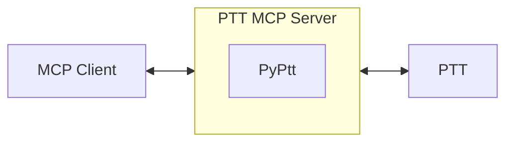

[Traditional Chinese Version](https://github.com/PyPtt/ptt_mcp_server/blob/main/README.md)

<h1 align="center">PTT MCP Server</h1>

<p align="center">  
The best MCP server for PTT. Proudly built by <a href="https://pyptt.cc/">PyPtt</a> developers.  
<br />  
<br />  
<a href="https://github.com/PyPtt/ptt_mcp_server/actions/workflows/code_quality.yml">  
  
</a>  
<a href="https://github.com/PyPtt/ptt_mcp_server/blob/main/LICENSE">  
  
</a>  
</p>

## **📖 Description**

This project is a PTT MCP (Model Context Protocol) server based on the powerful [PyPtt](https://www.google.com/search?q=%5Bhttps://pyptt.cc/%5D(https://pyptt.cc/)) library. It enables your MCP client to genuinely log into PTT, interact with the PTT Bulletin Board System via the MCP protocol, and perform automated operations.

## **🚀 Quick Start**

Using Docker is the most recommended way to deploy the PTT MCP Server, as it provides environment isolation and a simplified setup.

1. Install Docker:  
   If Docker is not already installed on your system, please refer to the official Docker documentation for installation instructions.  
2. Configure Your MCP Client:  
   Add the following configuration to your MCP client's settings file (e.g., ~/.gemini/settings.json). This setup allows the MCP client to automatically pull and run the Docker container when needed.
   ```json
   {  
     "mcpServers": {  
       "PTT": {  
         "command": "docker",  
         "args": [  
           "run",  
           "-i",  
           "--rm",  
           "-e", "PTT_ID",  
           "-e", "PTT_PW",  
           "ghcr.io/PyPtt/ptt_mcp_server:latest"  
         ],  
         "env": {  
           "PTT_ID": "YOUR_PTT_ID", // Please replace with your PTT account ID  
           "PTT_PW": "YOUR_PTT_PW"  // Please replace with your PTT password  
         }  
       }  
     }  
   }
   ```

   **Explanation:**  
   * "command": "docker": Instructs the MCP client to use the docker command to start the server.  
   * "args": Contains the arguments for the docker run command.  
     * -i: Keeps standard input (stdin) open so the MCP server can receive commands.  
     * --rm: Automatically removes the container when it stops, keeping your system clean.  
     * -e PTT_ID and -e PTT_PW: Tells Docker to pass the PTT_ID and PTT_PW environment variables to the container.  
     * ghcr.io/PyPtt/ptt_mcp_server:latest: Specifies the Docker image to run.  
   * "env": Sets PTT_ID and PTT_PW directly as environment variables. **Be sure to replace these with your own PTT account ID and password.**  
3. Launch and Test:  
   Your MCP client should now be able to start the PTT MCP server automatically. You can try a simple command, such as asking it to log into PTT, to test the connection.

## **💡 Usage Example**

Once your MCP client (e.g., Gemini CLI) is configured, you can interact with PTT like this:

**Your input:**

> Help me log into PTT

**MCP Client Execution (Behind the Scenes):**

1. The Gemini CLI calls the `login` function via the MCP protocol.  
2. `ptt-mcp-server` receives the command and uses the PyPtt library to perform the login.  
3. `ptt-mcp-server` returns the login success or failure result to the Gemini CLI.

**You will see:**

> Login successful

## **⚙️ How it Works**

This project acts as a middle layer. Your MCP client (e.g., Gemini CLI) connects to the locally running ptt-mcp-server. When the server receives a command, it connects to PTT through the [PyPtt](https://www.google.com/search?q=%5Bhttps://pyptt.cc/%5D(https://pyptt.cc/)) library, performs the corresponding action, and sends the result back to your client.



## **✨ Features in Detail**

| Category | Operation | Status |
| :---- | :---- | :---- |
| **Account Management** | Login, Logout | ✅ |
| **Post Management** | Get post list, Read post content, Create new post, Delete post | ✅ |
| **Post Interaction** | Push, Boo, Arrow, Reply to post | ✅ |
| **Mailbox System** | Read mail, Send new mail, Delete mail | ✅ |
| **Finance System** | Check P-coins, Transfer P-coins | ✅ |
| **Information Query** | Query user info, Query board info, **Get post index range** | ✅ |

## **⚠️ Important Suggestion & Disclaimer**

This project provides powerful PTT automation capabilities. However, please note that all actions are based on your authorization, and you are fully responsible for the consequences of all operations. To use this tool safely and effectively, we strongly recommend following these best practices:

**Best Practice: Read Before You Write, Confirm Before You Execute**

Before using any function that modifies PTT content (such as posting, replying, sending mail, pushing, etc.), always use a read function first to gather and confirm information.

* **Example:** Instead of directly ordering "delete violating posts," first "list all violating posts." After you have reviewed the list and confirmed it is correct, then execute the deletion.

This simple workflow can significantly reduce the risks associated with automation errors (e.g., accidental deletion of posts, posting incorrect content). Although the PTT MCP Server includes a final confirmation prompt before execution, it cannot completely prevent operational mistakes. **Please double-check the content carefully before submitting!**

Please remember that the developers of this project are not responsible for any loss or liability caused by the use of this server.

## **🗺️ Roadmap**

* [ ] Support more PTT features (e.g., digest operations).  
* [x] Provide a Docker image to simplify the deployment process.  
* [ ] Write more comprehensive documentation and examples.  
* [ ] Optimize performance and connection stability.

We welcome your suggestions via [Issues](https://github.com/PyPtt/ptt_mcp_server/issues)!

## **🤝 Contributing**

We warmly welcome contributions of any kind!

* **Have questions or suggestions?** Please open an issue on [GitHub Issues](https://github.com/PyPtt/ptt_mcp_server/issues).  
* **Want to contribute code?**  
  1. Fork the project.  
  2. Create your feature branch (git checkout -b feature/AmazingFeature).  
  3. Commit your changes (git commit -m 'Add some AmazingFeature').  
  4. Push to your branch (git push origin feature/AmazingFeature).  
  5. Open a Pull Request.

## **💬 Community**

Join our community to connect with other developers!

* [**Telegram**](https://t.me/PyPtt)

## **👥 Contributors**

<!-- readme: collaborators,contributors -start -->
<table>
	<tbody>
		<tr>
            <td align="center">
                <a href="https://github.com/PichuChen">
                    
                    <br />
                    <sub><b>Pichu Chen</b></sub>
                </a>
            </td>
            <td align="center">
                <a href="https://github.com/denkeni">
                    
                    <br />
                    <sub><b>denkeni</b></sub>
                </a>
            </td>
            <td align="center">
                <a href="https://github.com/PttCodingMan">
                    
                    <br />
                    <sub><b>CodingMan</b></sub>
                </a>
            </td>
		</tr>
	<tbody>
</table>
<!-- readme: collaborators,contributors -end -->

## **🙏 Acknowledgements**

* [**PyPtt**](https://pyptt.cc/) - The core library that drives this project's interaction with PTT.  
* [**fastmcp**](https://github.com/jlowin/fastmcp) - Provides a high-performance MCP server framework.

For third-party libraries used in this project and their license terms, please see the [licenses](https://www.google.com/search?q=%5Bhttps://github.com/PyPtt/ptt_mcp_server/tree/main/licenses%5D(https://github.com/PyPtt/ptt_mcp_server/tree/main/licenses)) folder.

## **📄 License**

This project is licensed under the [BSD 3-Clause License](https://github.com/PyPtt/ptt_mcp_server/blob/main/LICENSE).