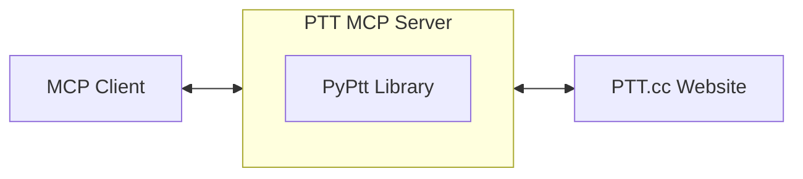

[Traditional Chinese Version](https://github.com/PyPtt/ptt_mcp_server/blob/main/README.md)

<h1 align="center">PTT MCP Server</h1>

<p align="center">
The best MCP server for Ptt. Proudly built by the <a href="https://pyptt.cc/">PyPtt</a> developer.
<br />
<br />
<a href="https://pypi.org/project/ptt-mcp-server/">

</a>
<a href="https://www.python.org/downloads/">

</a>
<a href="https://img.shields.io/pypi/dm/ptt-mcp-server">

</a>
<a href="https://github.com/PyPtt/ptt_mcp_server/blob/main/LICENSE">

</a>
</p>

## 📖 Description
This project is a PTT MCP (Model Context Protocol) server based on the powerful [`PyPtt`](https://pyptt.cc/) library. It enables your MCP client to directly log into PTT, interact with the PTT Bulletin Board System through the MCP protocol, and perform automated operations.

## 🚀 Quick Start

1.  **Install the package:**
    ```bash
    pip install ptt-mcp-server
    ```

2.  **Configure your MCP client:**
    Add the following configuration to your MCP client's settings file and fill in your PTT credentials.

    ```json
    {
      "mcpServers": {
        "PTT": {
          "command": "ptt-mcp-server",
          "env": {
            "PTT_ID": "YOUR_PTT_ID", // Replace with your PTT ID
            "PTT_PW": "YOUR_PTT_PW"  // Replace with your PTT password
          }
        }
      }
    }
    ```

3.  **Launch and test:**
    Your MCP client should now be able to automatically start the PTT MCP server. You can test the connection by trying a simple command, such as asking it to log into PTT.

## 💡 Usage Example

Once your MCP client (e.g., Gemini CLI) is configured, you can interact with PTT like this:

**You type:**
> Log me into PTT

**MCP Client Execution (Behind the Scenes):**
1.  The Gemini CLI calls the `login` function via the MCP protocol.
2.  `ptt-mcp-server` receives the command and uses the `PyPtt` library to perform the login.
3.  `ptt-mcp-server` returns the login result (success or failure) to the Gemini CLI.

**You will see:**
> Login successful

## ⚙️ How it Works
This project acts as middleware. Your MCP client (e.g., Gemini CLI) connects to the locally running `ptt-mcp-server`. When the server receives a command, it uses the [`PyPtt`](https://pyptt.cc/) library to connect to PTT and execute the corresponding action, finally returning the result to your client.



## ✨ Features in Detail

| Category             | Operations                                       | Status |
|:---------------------|:-------------------------------------------------|:-------|
| **Account Management** | Login, Logout                                    | ✅     |
| **Post Management**    | Get post list, Read post, Create new post, Delete post | ✅     |
| **Post Interaction**   | Push, Boo, Arrow, Reply to post                  | ✅     |
| **Mail System**        | Read mail, Send new mail, Delete mail            | ✅     |
| **Financial System**   | Check P Coin balance, Transfer P Coins           | ✅     |
| **Information Query**  | Query user info, Query board info, **Get post index range** | ✅     |

## ⚠️ Important Suggestion & Disclaimer

This project provides powerful PTT automation capabilities, but please note that all actions are based on your authorization, and you are fully responsible for the consequences of all operations. To use this tool safely and effectively, we strongly recommend following these best practices:

**Best Practice: Read Before You Write, Confirm Before You Execute**

Before using any function that modifies PTT content (such as posting, replying, sending mail, pushing comments, etc.), be sure to first use read functions to gather and confirm information.

*   **Example:** Instead of directly ordering to "delete violating posts," first "list all violating posts." After you have reviewed the list and confirmed its accuracy, then execute the deletion.

This simple process can significantly reduce the risk of operational errors (e.g., accidental deletion of posts, sending incorrect content). Although the PTT MCP Server will prompt you for final confirmation before execution, it cannot completely prevent the possibility of incorrect operations. **Please carefully check the content before submitting!**

Please remember that the developers of this project are not responsible for any loss or liability caused by the use of this server.

## 📋 Requirements

* Python 3.10 or newer.

## 🚀 Installation & Setup

Please follow the steps below to install and set up your MCP server.

### **Step 1: Install the Package**

Open your terminal and run the following command:

```bash
pip install ptt-mcp-server
```

### **Step 2: Configure the MCP Client**

Your MCP client needs to know how to start this server. Here are two ways to configure it.

**Security Tip:** It is recommended to use environment variables for your PTT credentials to avoid writing sensitive information directly in configuration files.

#### **Method A: Standard Path (Recommended)**

After installation, the `ptt-mcp-server` command should be available in your shell. This is the simplest setup method.

```json
{
  "mcpServers": {
    "PTT": {
      "command": "ptt-mcp-server",
      "env": { /* PTT_ID and PTT_PW should be set as environment variables */ }
    }
  }
}
```

#### **Method B: Absolute Path with a Virtual Environment**

If you use a Python virtual environment, or if the `command` cannot be executed directly, you can provide the absolute paths to the Python interpreter and the script.

```json
{
  "mcpServers": {
    "PTT": {
      "command": "/path/to/your/venv/bin/python3",
      "args": [
        "/path/to/your/venv/bin/ptt-mcp-server"
      ],
      "env": { /* PTT_ID and PTT_PW should be set as environment variables */ }
    }
  }
}
```

**How to find the paths?**

*   **command**: After activating your virtual environment, run `which python3`.
*   **args**: After activating your virtual environment, run `which ptt-mcp-server`.

## 🗺️ Roadmap

- [ ] Support for more PTT features (e.g., digest/best-of operations).
- [ ] Provide a Docker image to simplify the deployment process.
- [ ] Write more comprehensive documentation and examples.
- [ ] Optimize performance and connection stability.

Feel free to provide suggestions via [Issues](https://github.com/PyPtt/ptt_mcp_server/issues)!

## 🤝 Contributing

Contributions of any kind are welcome! Whether it's reporting an issue or submitting a pull request, we appreciate all input. Please feel free to share your ideas!

-   **Have questions or suggestions?** Open an issue on [GitHub Issues](https://github.com/PyPtt/ptt_mcp_server/issues).
-   **Want to contribute code?**
    1.  Fork the project.
    2.  Create your feature branch (`git checkout -b feature/AmazingFeature`).
    3.  Commit your changes (`git commit -m 'Add some AmazingFeature'`).
    4.  Push to the branch (`git push origin feature/AmazingFeature`).
    5.  Open a Pull Request.

## 👥 Contributors

<!-- readme: collaborators,contributors -start -->
<table>
	<tbody>
		<tr>
            <td align="center">
                <a href="https://github.com/PichuChen">
                    
                    <br />
                    <sub><b>Pichu Chen</b></sub>
                </a>
            </td>
            <td align="center">
                <a href="https://github.com/denkeni">
                    
                    <br />
                    <sub><b>denkeni</b></sub>
                </a>
            </td>
            <td align="center">
                <a href="https://github.com/PttCodingMan">
                    
                    <br />
                    <sub><b>CodingMan</b></sub>
                </a>
            </td>
		</tr>
	<tbody>
</table>
<!-- readme: collaborators,contributors -end -->

## 🙏 Acknowledgements

* [**PyPtt**](https://pyptt.cc/) - The core library that handles the interaction between this project and PTT.
* [**fastmcp**](https://github.com/jlowin/fastmcp) - Provides the high-performance MCP server framework.

## 📄 License

This project is licensed under the [BSD 3-Clause License](https://github.com/PyPtt/ptt_mcp_server/blob/main/LICENSE).
