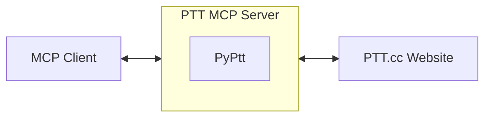

[Traditional Chinese Version](https://github.com/PyPtt/ptt_mcp_server/blob/main/README.md)

<h1 align="center">PTT MCP Server</h1>

<p align="center">  
The best MCP server for Ptt. Proudly built by the <a href="https://pyptt.cc/">PyPtt</a> developer.  
<br />  
<br />  
<a href="https://pypi.org/project/ptt-mcp-server/">  
  
</a>  
<a href="https://www.python.org/downloads/">  
  
</a>  
<a href="https://img.shields.io/pypi/dm/ptt-mcp-server">  
  
</a>  
<a href="https://github.com/PyPtt/ptt_mcp_server/actions/workflows/code_quality.yml">  
  
</a>  
<a href="https://github.com/PyPtt/ptt_mcp_server/blob/main/LICENSE">  
  
</a>  
</p>

## **📖 Description**

This project is a PTT MCP (Model Context Protocol) server based on the powerful [PyPtt](https://www.google.com/search?q=%5Bhttps://pyptt.cc/%5D(https://pyptt.cc/)) library. It enables your MCP client to genuinely log into PTT and perform actual interactions and automated operations with the PTT Bulletin Board System via the MCP protocol.

## **🚀 Quick Start**

1. **Install the package (using venv):**

   ```bash
   python3 -m venv venv  
   source venv/bin/activate  
   pip install ptt-mcp-server
   ```

   * When you use it the next time, you can just start from source venv/bin/activate 😊  
3. Configure your MCP client:  
   Add the following configuration to your MCP client's settings file and fill in your PTT account ID and password.  
   For example, if you are using gemini-cli, you can copy and paste this into the .gemini/settings.json file in your current project folder.

   ```json
   {  
     "mcpServers": {  
       "PTT": {  
         "command": "ptt-mcp-server",  
         "env": {  
           "PTT_ID": "YOUR_PTT_ID", // Please replace with your own PTT ID  
           "PTT_PW": "YOUR_PTT_PW"  // Please replace with your own PTT password  
         }  
       }  
     }  
   }
   ```

4. Launch and Test:  
   Your MCP client should now be able to automatically start the PTT MCP server. You can try a simple command to test the connection, such as asking it to log in to PTT.

## **💡 Usage Example**

Once your MCP client (e.g., Gemini CLI) is configured, you can interact with PTT like this:

**You input:**
```
Help me log in to PTT
```
**MCP Client Execution (Behind the scenes):**

1. Gemini CLI calls the login function via the MCP protocol.  
2. `ptt-mcp-server` receives the command and executes the login using the PyPtt library.  
3. `ptt-mcp-server` returns the login success or failure result to Gemini CLI.

**You will see:**
```
Login successful
```

## **⚙️ How it Works**

This project acts as a middle layer. Your MCP client (e.g., Gemini CLI) connects to the ptt-mcp-server running locally. When the server receives a command, it connects to PTT through the [PyPtt](https://www.google.com/search?q=%5Bhttps://pyptt.cc/%5D(https://pyptt.cc/)) library, performs the corresponding action, and sends the result back to your client.



## **✨ Features in Detail**

| Feature Category | Specific Operation | Support Status |
| :---- | :---- | :---- |
| **Account Management** | Login, Logout | ✅ |
| **Post Management** | Get post list, Read post content, Create new post, Delete post | ✅ |
| **Post Interaction** | Push, Shush, Give arrow, Reply to post | ✅ |
| **Mailbox System** | Read mail, Send new mail, Delete mail | ✅ |
| **Financial System** | Check P-coins, Transfer P-coins | ✅ |
| **Information Query** | Query user info, Query board info, **Get post index range** | ✅ |

## **⚠️ Important Suggestion & Disclaimer**

This project provides powerful PTT automation capabilities. However, please be aware that all operations are based on your authorization, and you are fully responsible for the consequences of all actions. To use this tool safely and effectively, we strongly recommend following these best practices:

**Best Practice: Read before you write, confirm before you execute**

Before using any function that modifies PTT content (such as posting, replying, sending mail, pushing, etc.), always use the read functions first to gather and confirm information.

* **Example:** Instead of directly ordering "delete violating posts," first "list all violating posts." After you have reviewed the list and confirmed it is correct, then execute the deletion.

This simple process can significantly reduce the risks associated with automation errors (e.g., accidental deletion of posts, sending incorrect content). Although PTT MCP Server prompts you for final confirmation before execution, it cannot completely prevent the possibility of misoperation. **Please double-check the content before sending!**

Please remember that the developers of this project are not responsible for any loss or liability caused by using this server.

## **📋 Requirements**

* Python 3.10 or newer.

## **🚀 Installation & Setup**

Please follow the steps below to install and set up your MCP server.

### **Step 1: Install the Package**

Open your terminal and run the following command:

```bash
pip install ptt-mcp-server
```

### **Step 2: Configure the MCP Client**

Your MCP client needs to know how to start this server. Two configuration methods are provided below.

**Security Tip**: It is recommended to use environment variables to set your PTT ID and password to avoid writing sensitive information directly in the configuration file.

#### **Method A: Standard Path Configuration (Recommended)**

After installation, ptt-mcp-server should already be in your system's Python environment. This is the simplest configuration method.

```json
{
  "mcpServers": {
    "PTT": {
      "command": "ptt-mcp-server",
      "env": { /* PTT_ID and PTT_PW should be set as environment variables */ }
    }
  }
}
```

#### **Method B: Absolute Path with a Virtual Environment**

If you use a Python virtual environment, or if the `command` cannot be executed directly, you can provide the absolute paths to the Python interpreter and the script.

```json
{
  "mcpServers": {
    "PTT": {
      "command": "/path/to/your/venv/bin/python3",
      "args": [
        "/path/to/your/venv/bin/ptt-mcp-server"
      ],
      "env": { /* PTT_ID and PTT_PW should be set as environment variables */ }
    }
  }
}
```

**How to find the paths?**

* **command**: After activating your virtual environment, run which python3.  
* **args**: After activating your virtual environment, run which ptt-mcp-server.

## **🗺️ Roadmap**

* [ ] Support more PTT features (e.g., digest operations).  
* [ ] Provide a Docker image to simplify deployment.  
* [ ] Write more comprehensive documentation and examples.  
* [ ] Optimize performance and connection stability.

Suggestions are welcome via [Issues](https://github.com/PyPtt/ptt_mcp_server/issues)!

## **🤝 Contributing**

We warmly welcome any form of contribution!

* **Have questions or suggestions?** Please open an issue on [GitHub Issues](https://github.com/PyPtt/ptt_mcp_server/issues).  
* **Want to contribute code?**  
  1. Fork this project.  
  2. Create your feature branch (`git checkout -b feature/AmazingFeature`).  
  3. Commit your changes (`git commit -m 'Add some AmazingFeature'`).  
  4. Push to your branch (`git push origin feature/AmazingFeatur`e).  
  5. Open a Pull Request.

## **💬 Community**

Feel free to join our community to chat with other developers!

* [**Telegram**](https://t.me/PyPtt)

## **👥 Contributors**

<!-- readme: collaborators,contributors -start -->
<table>
	<tbody>
		<tr>
            <td align="center">
                <a href="https://github.com/PichuChen">
                    
                    <br />
                    <sub><b>Pichu Chen</b></sub>
                </a>
            </td>
            <td align="center">
                <a href="https://github.com/denkeni">
                    
                    <br />
                    <sub><b>denkeni</b></sub>
                </a>
            </td>
            <td align="center">
                <a href="https://github.com/PttCodingMan">
                    
                    <br />
                    <sub><b>CodingMan</b></sub>
                </a>
            </td>
		</tr>
	<tbody>
</table>
<!-- readme: collaborators,contributors -end -->

## **🙏 Acknowledgements**

* [**PyPtt**](https://pyptt.cc/) - The core library that drives this project's interaction with PTT.  
* [**fastmcp**](https://github.com/jlowin/fastmcp) - Provides a high-performance MCP server framework.

For third-party libraries used in this project and their license terms, please refer to the [licenses](https://www.google.com/search?q=%5Bhttps://github.com/PyPtt/ptt_mcp_server/tree/main/licenses%5D(https://github.com/PyPtt/ptt_mcp_server/tree/main/licenses)) folder.

## **📄 License**

This project is licensed under the [BSD 3-Clause License](https://github.com/PyPtt/ptt_mcp_server/blob/main/LICENSE).